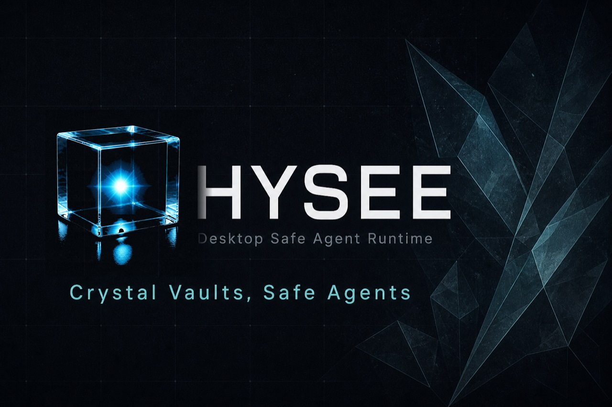
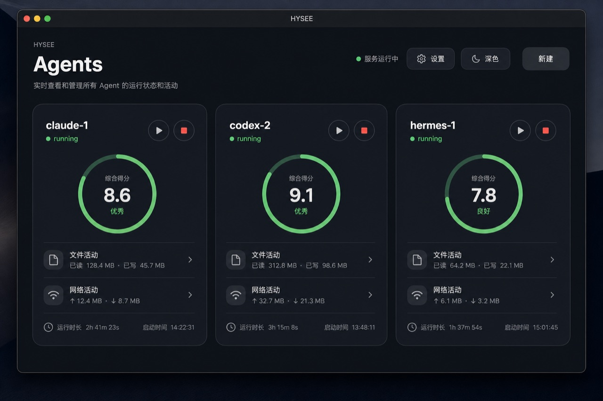
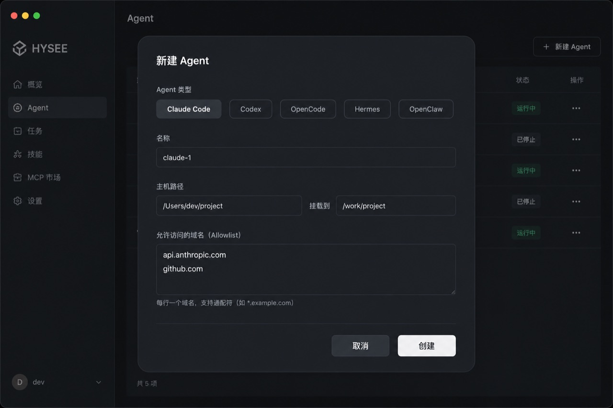
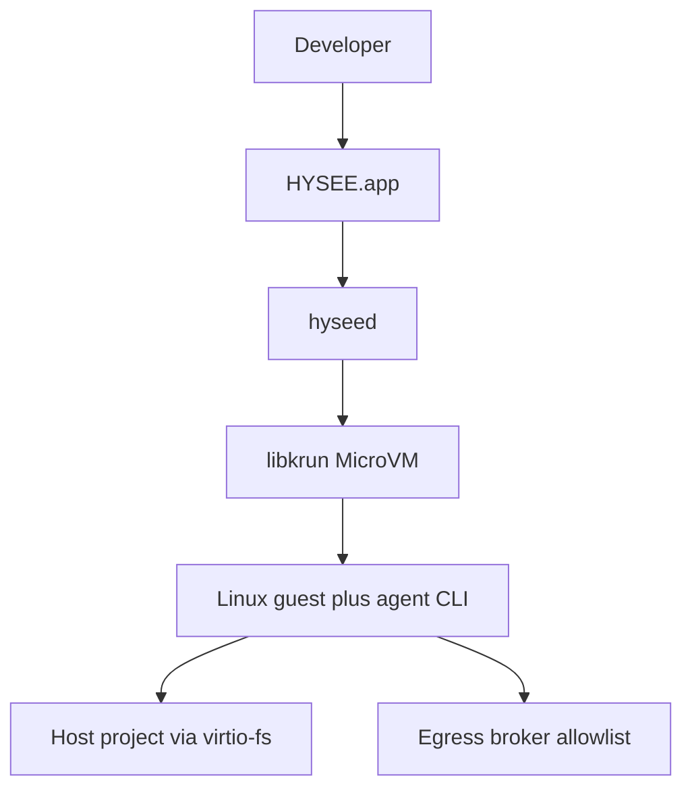
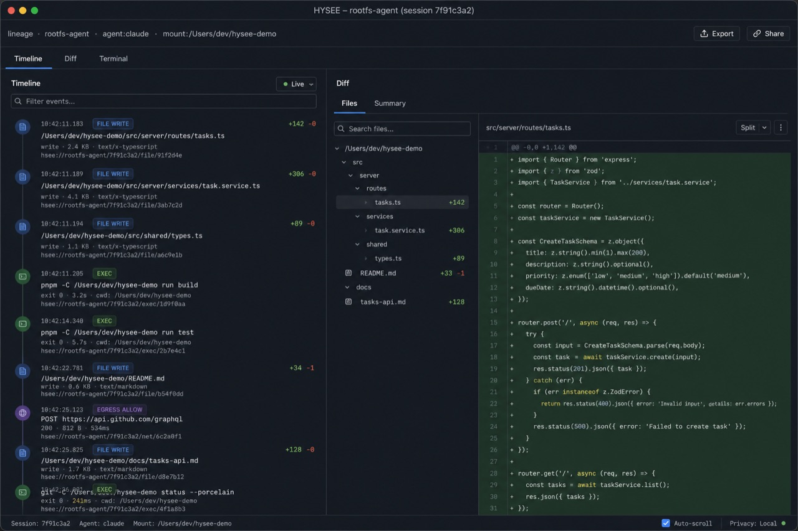
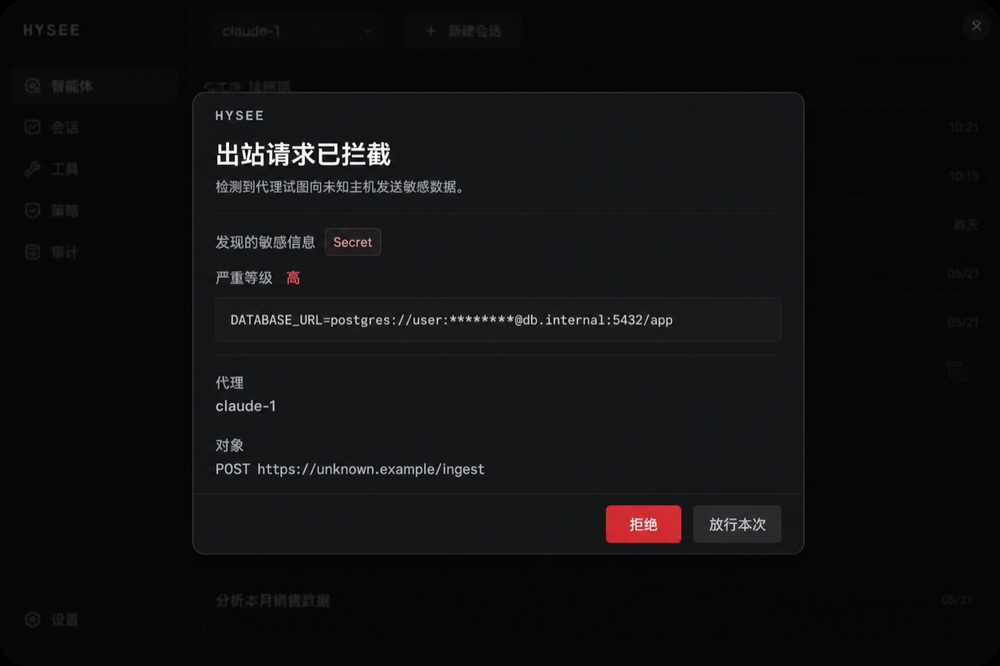

  

<h1 align="center">HYSEE</h1>

<b>Desktop Safe Agent Runtime</b>

Crystal Vaults, Safe Agents

  <a href="README.md">English</a> · <a href="README.zh-CN.md">中文</a>

  
  
  

  

HYSEE runs coding agents inside hardware-isolated MicroVMs on your desktop. Each agent gets a crystal vault: a Linux guest, a glass-box control plane (timeline, diff, terminal), and host-brokered egress. The host OS stays outside the blast radius.

  <a href="https://hysee.ai"><b>Get HYSEE</b></a>
  ·
  <a href="docs/install.md">Install notes</a>

  

## What it is

A vault is three things at once:

- **Isolated.** The agent runs in a libkrun MicroVM with a Linux guest. The host kernel and your home directory are not the agent's filesystem.
- **Visible.** Timeline, Diff, and Terminal turn agent work into a glass box. You see file edits, commands, and network decisions.
- **Gated.** Outbound traffic goes through a host broker. Only allowlisted hosts pass. Unknown egress is blocked or held for you.

HYSEE is not a chatbot, not a cloud agent platform, and not Docker Desktop with extra steps. It is a local execution cabin for agents that must touch your files and the network.

Supported agents today: Claude Code, Codex, OpenCode, Hermes, OpenClaw.

## Download

Current installer: **macOS 13 Ventura+ (Apple Silicon)**.

1. Open [hysee.ai](https://hysee.ai).
2. Download the macOS Apple Silicon installer and drag **HYSEE.app** to Applications.

The first agent you create downloads a guest rootfs (cached locally, similar to a container image). App launch itself does not wait on that download.

Linux and Windows installers are not available yet. Details: [docs/install.md](docs/install.md).

## How a vault runs

**Create the agent.** Pick Claude Code, Codex, OpenCode, Hermes, or OpenClaw. Bind a host project folder. Edit the egress allowlist.

**Work in the cabin.** The guest is Linux. Your project is mounted at `/work/<name>` via virtio-fs. Scratch stays in the vault. Reset clears scratch and does not delete the host tree.

**Watch the glass.** Timeline, Diff, and Terminal stay attached while the MicroVM is running. Unknown egress is blocked or asked.

  

## Architecture

The desktop app talks to a local `hyseed` daemon. The daemon starts a MicroVM, mounts the host project, and brokers guest HTTP(S) through the allowlist. Full write-up: [docs/architecture.md](docs/architecture.md).

## Security model

- **Boundary:** hardware virtualization (libkrun on macOS), not a container on the host kernel.
- **Host stay-out:** the agent does not receive your `$HOME`. Only the folders you bind are visible inside the guest.
- **Egress:** default-deny except the allowlist you set per agent. Wildcard hosts such as `*.opencode.ai` are supported.
- **Ask:** policy hits can pause the agent until you allow or deny.

Not in this release: snapshot rollback, full DLP redaction of secrets in flight, Windows or Linux installers. Honest map: [docs/security.md](docs/security.md).

## Gallery

  

  

## Docs

- [Architecture](docs/architecture.md)
- [Install](docs/install.md)
- [Security model](docs/security.md)
- [中文说明](README.zh-CN.md)

## License

[Apache License 2.0](LICENSE)

This repository is the public developer docs and home for HYSEE. Application source is not published here. The product site and downloads live at [hysee.ai](https://hysee.ai).

GitHub social preview image: [`assets/brand/social-card8.jpg`](assets/brand/social-card8.jpg).
