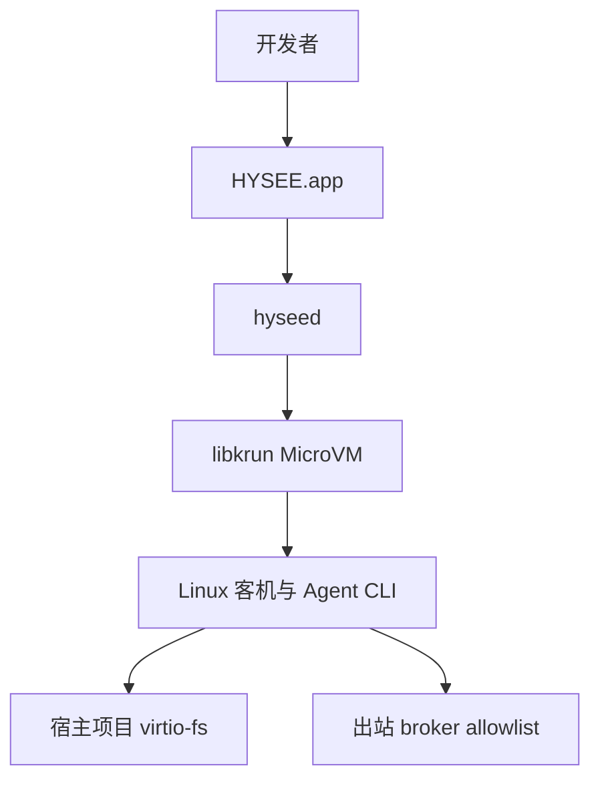

<p align="center">
  
</p>

<h1 align="center">海视 HYSEE</h1>

<p align="center"><b>桌面级 Agent 安全执行环境</b></p>
<p align="center">智能体极致安全舱</p>

<p align="center">
  <a href="README.md">English</a> · <a href="README.zh-CN.md">中文</a>
</p>

<p align="center">
  <a href="LICENSE"></a>
  <a href="https://hysee.ai"></a>
  <a href="https://hysee.ai"></a>
</p>

<p align="center">
  
</p>

海视把编码 Agent 放进桌面级、硬件隔离的 MicroVM。每个 Agent 一间水晶舱：Linux 客机、玻璃盒控制面（时间线、Diff、终端）、由主机代管的出站网络。宿主操作系统不在爆炸半径里。

<p align="center">
  <a href="https://hysee.ai"><b>获取海视</b></a>
  ·
  <a href="docs/install.zh-CN.md">安装说明</a>
</p>

<p align="center">
  
</p>

## 它是什么

一间舱同时做三件事：

- **隔离。** Agent 跑在 libkrun MicroVM 的 Linux 客机里。宿主内核和你的家目录不是它的文件系统。
- **可视。** Timeline、Diff、Terminal 把 Agent 的工作变成玻璃盒。文件改动、命令、网络裁决都看得到。
- **受控。** 出站流量走主机上的 broker。只放行你写入的 allowlist。未知外连会被拦截，或停下来问你。

海视不是聊天机器人，不是云端 Agent 平台，也不是套了皮的 Docker Desktop。它是给必须碰本地文件和网络的智能体准备的本机执行舱。

当前可跑：Claude Code、Codex、OpenCode、Hermes、OpenClaw。

## 下载

当前安装包：**macOS 13 Ventura+（Apple Silicon）**。

1. 打开 [hysee.ai](https://hysee.ai)。
2. 下载 macOS Apple Silicon 安装包，把 **HYSEE.app** 拖进应用程序。

第一次创建 Agent 时会下载客机 rootfs（本地持久缓存，类似容器镜像）。启动 App 本身不会卡在这次下载上。

HYSEE 使用 ad-hoc 签名（没有 Apple Developer ID）。若系统拦截首次打开：

```bash
xattr -cr /Applications/HYSEE.app
```

或右键 HYSEE.app，选打开，再确认。

Linux / Windows 安装包尚不可用。详见 [docs/install.zh-CN.md](docs/install.zh-CN.md)。

## 一间舱怎么跑

**创建 Agent。** 选择 Claude Code、Codex、OpenCode、Hermes 或 OpenClaw。挂上本机项目目录。改出站 allowlist。

**在舱里干活。** 客机是 Linux。你的项目通过 virtio-fs 挂到 `/work/<name>`。临时文件留在舱内。Reset 只清舱内草稿，不会删宿主目录。

**看玻璃盒。** MicroVM 运行期间，Timeline、Diff、Terminal 一直连着。未知出站会被拦截或询问。

<p align="center">
  
</p>

## 架构



桌面应用连接本机 `hyseed` 守护进程。守护进程拉起 MicroVM、挂上宿主项目、按 allowlist 代理客机 HTTP(S)。完整说明：[docs/architecture.zh-CN.md](docs/architecture.zh-CN.md)。

## 安全模型

- **边界：** 硬件虚拟化（macOS 上的 libkrun），不是宿主内核上的容器。
- **宿主不进舱：** Agent 拿不到你的 `$HOME`。只有你绑定的目录在客机里可见。
- **出站：** 默认拒绝，只放行该 Agent 的 allowlist。支持 `*.opencode.ai` 这类通配。
- **询问：** 策略命中可以暂停 Agent，等你允许或拒绝。

本版本没有：快照回滚、传输中密钥的完整 DLP 脱敏、Windows / Linux 安装包。对照表：[docs/security.zh-CN.md](docs/security.zh-CN.md)。

## 效果图

<p align="center">
  
</p>

<p align="center">
  
</p>

## 文档

- [架构](docs/architecture.zh-CN.md)
- [安装](docs/install.zh-CN.md)
- [安全模型](docs/security.zh-CN.md)
- [English](README.md)

## 许可

[Apache License 2.0](LICENSE)

本仓库是海视面向开发者的公开文档与主页。应用源码不在这里发布。产品站与下载在 [hysee.ai](https://hysee.ai)。

GitHub 仓库社交预览图：[`assets/brand/social-card8.jpg`](assets/brand/social-card8.jpg)。
