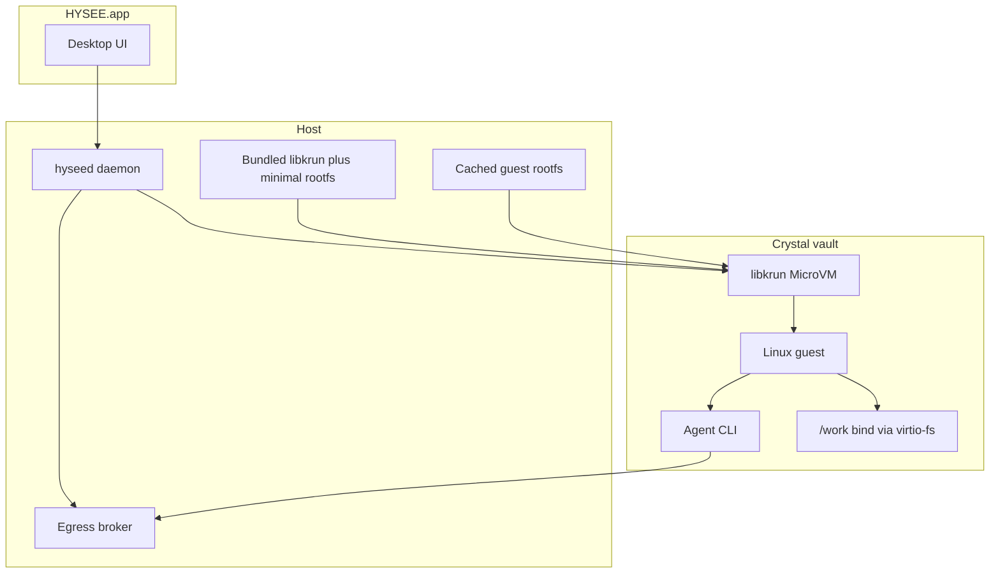

# Architecture

HYSEE is a **desktop safe agent runtime**. The product you download is a local control plane plus a MicroVM cabin, not a hosted agent service.

This repository is the public developer docs and home for HYSEE. Application source is not published here. Downloads live at [hysee.ai](https://hysee.ai).

[中文](architecture.zh-CN.md)

## Layers

| Layer | What it is | What it does |
| --- | --- | --- |
| HYSEE.app | Electron desktop shell | Agent deck, create wizard, session windows (Timeline / Diff / Terminal), intercept prompts |
| `hyseed` | Local daemon | Lifecycle: create, start, stop, reset, destroy. Event bus. Allowlist updates |
| libkrun MicroVM | Hardware-isolated VM on macOS Apple Silicon | Linux guest, no virtio-net NIC. Egress is proxied |
| Guest | Linux rootfs | Agent CLI, toolchain, scratch. Project files appear under `/work/<name>` |
| Egress broker | Host-side HTTP(S) proxy | Default-deny except the per-agent allowlist. Ask or block on hits |

## Create and first run

1. You pick an agent kind (Claude Code, Codex, OpenCode, Hermes, OpenClaw), a display name, optional host folder binds, and an egress allowlist.
2. `hyseed` creates a sandbox record and a guest overlay. If the agent rootfs is not cached, the shell downloads it once into `~/Library/Application Support/HYSEE/` and keeps it (same idea as a local image).
3. Start boots the MicroVM, waits until the in-guest agent is ready, then opens a session window.
4. Your host folder is mounted read-write at `/work/<basename>`. Reset clears vault scratch only. It does not delete the host tree.

The slim `.dmg` does **not** ship the full agent rootfs. That keeps the installer small. Launching the app does not download it; creating or starting an agent does.

## Control plane surface

The UI is a glass box over the vault, not a chat wrapper:

- **Deck:** running and stopped agents, heartbeat, file and network activity.
- **Timeline:** structured events from the guest path (exec, files, egress decisions).
- **Diff:** file-tree view of what changed on the bound project.
- **Terminal:** PTY into the guest, kept across tab switches.
- **Guard prompt:** allow, deny, or remember when policy hits.

## What this architecture is not

- Not a cloud sandbox. The MicroVM runs on the machine in front of you.
- Not Docker-in-Docker as the isolation boundary. Isolation is the MicroVM. Guest Docker is not a shipped feature.
- Not a snapshot time machine. Stop drops live memory. True freeze/restore is not in the current release.

## Related docs

- [Install](install.md)
- [Security model](security.md)
