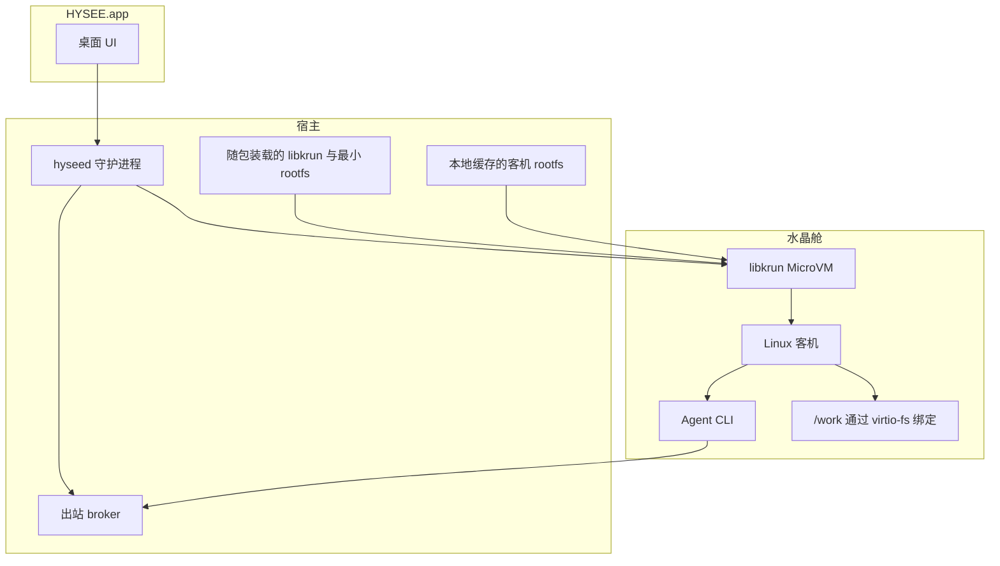

# 架构

海视是 **桌面级 Agent 安全执行环境**。你下载到的是本机控制面加上 MicroVM 舱，不是托管 Agent 服务。

本仓库是海视面向开发者的公开文档与主页。应用源码不在这里发布。下载在 [hysee.ai](https://hysee.ai)。

[English](architecture.md)

## 分层

| 层 | 是什么 | 做什么 |
| --- | --- | --- |
| HYSEE.app | Electron 桌面壳 | Agent 甲板、新建向导、会话窗（Timeline / Diff / Terminal）、拦截询问 |
| `hyseed` | 本机守护进程 | 生命周期：创建、启动、停止、重置、销毁。事件总线。更新 allowlist |
| libkrun MicroVM | macOS Apple Silicon 上的硬件隔离虚拟机 | Linux 客机，没有 virtio-net 网卡。出站走代理 |
| 客机 | Linux rootfs | Agent CLI、工具链、草稿。项目文件出现在 `/work/<name>` |
| 出站 broker | 宿主侧 HTTP(S) 代理 | 默认拒绝，只放行该 Agent 的 allowlist。命中则询问或阻断 |

## 创建与第一次运行

1. 选择 Agent 类型（Claude Code、Codex、OpenCode、Hermes、OpenClaw）、名称、可选的宿主目录绑定、出站 allowlist。
2. `hyseed` 记下沙箱并准备客机 overlay。若 agent rootfs 尚未缓存，壳会下载一次，放到 `~/Library/Application Support/HYSEE/` 里长期保留（类似本地镜像）。
3. Start 拉起 MicroVM，等到舱内 Agent 就绪，再打开会话窗。
4. 宿主目录以读写方式挂到 `/work/<basename>`。Reset 只清舱内草稿，不删宿主树。

瘦身 `.dmg` **不包含** 完整 agent rootfs，所以安装包小。启动 App 不会去下它；创建或启动 Agent 时才会。

## 控制面

界面是舱的玻璃盒，不是套了一层聊天：

- **甲板：** 运行 / 停止中的 Agent、心跳、文件与网络活跃度。
- **Timeline：** 来自客机路径的结构化事件（执行、文件、出站裁决）。
- **Diff：** 绑定项目上改了哪些文件。
- **Terminal：** 客机 PTY，切换标签也不会丢掉。
- **拦截询问：** 策略命中时允许、拒绝，或记住这次选择。

## 这套架构不是什么

- 不是云沙箱。MicroVM 跑在你面前这台机器上。
- 隔离边界不是 Docker-in-Docker。隔离是 MicroVM。舱内 Docker 不是当前交付。
- 不是快照时光机。Stop 会丢掉内存态。真正的冻结 / 恢复不在本版本。

## 相关文档

- [安装](install.zh-CN.md)
- [安全模型](security.zh-CN.md)
